# dotnet_dev_docker_almalinux8_vscode

## 実験中
* VSCode 内蔵するぞ

```
docker compose exec dev bash
```

```
wget 'https://code.visualstudio.com/sha/download?build=stable&os=cli-alpine-x64' -O vscode_cli.tar.gz
tar -xf vscode_cli.tar.gz
```
x64 の Linux は cli-alpine-x64 しか選択肢が無いっぽい？
https://code.visualstudio.com/sha でリストが見れる  

```
$ ./code --version
code 1.93.1 (commit 38c31bc77e0dd6ae88a4e9cc93428cc27a56ba40)
```
```
code serve-web --help
```


```
$ code serve-web --help
Runs a local web version of Visual Studio Code

Usage: code-tunnel serve-web [OPTIONS]

Options:
      --host <HOST>
          Host to listen on, defaults to 'localhost'
      --socket-path <SOCKET_PATH>
          
      --port <PORT>
          Port to listen on. If 0 is passed a random free port is picked [default: 8000]
      --connection-token <CONNECTION_TOKEN>
          A secret that must be included with all requests
      --connection-token-file <CONNECTION_TOKEN_FILE>
          A file containing a secret that must be included with all requests
      --without-connection-token
          Run without a connection token. Only use this if the connection is secured by other means
      --accept-server-license-terms
          If set, the user accepts the server license terms and the server will be started without a user prompt
      --server-base-path <SERVER_BASE_PATH>
          Specifies the path under which the web UI and the code server is provided
      --server-data-dir <SERVER_DATA_DIR>
          Specifies the directory that server data is kept in
      --user-data-dir <USER_DATA_DIR>
          Specifies the directory that user data is kept in. Can be used to open multiple distinct instances of Code
      --extensions-dir <EXTENSIONS_DIR>
          Set the root path for extensions
  -h, --help
          Print help

GLOBAL OPTIONS:
      --cli-data-dir <CLI_DATA_DIR>  Directory where CLI metadata should be stored [env: VSCODE_CLI_DATA_DIR=]
      --verbose                      Print verbose output (implies --wait)
      --log <level>                  Log level to use [possible values: trace, debug, info, warn, error, critical, off]
```

```
./code serve-web --without-connection-token
```

```
./code serve-web --without-connection-token --host 0.0.0.0
```

```
ssh user@localhost -p2222 -L 8000:127.0.0.1:8000
```
bind [127.0.0.1]:8000: Permission denied
/etc/ssh/sshd_config
AllowTcpForwarding が yes になっているか確認

VSCode 組み込みのポート転送は使えないっぽい？
ssh で接続してポート転送した方がいいかも

* Git のアイコンに定期的に時計マークが表示されて煩わしい
* デフォルトで自動保存の設定: 「Auto Save」が有効になっている（編集したそばから保存されていく）  
  →　dotnet watch と相性が悪い
* WPF の XAML がビルドするまでエラーを吐き続ける　※プロジェクトのエラーがポップし続ける

dotnet watch --project ExampleApp.Web --urls "http://127.0.0.1:5000"
ssh user@localhost -p2222 -L 8000:localhost:8000 -L 5000:localhost:5000

### 参考
* サーバー上のVS Codeでリモート開発　tunnelとserve-web  
  https://shugomatsuzawa.com/techblog/2024/02/27/351/

## 概要
* .NET の開発環境を Docker で構築する
* VSCode の Remote-SSH で接続して開発する

### その他
* 素の AlmaLinux8 をベースにし、プロジェクトに合わせて変更しやすいようにする
* 一般ユーザーを追加し、sudo が使えるようにする

## 想定する利用方法
開発者は自分の端末に VSCode、Remote-SSH だけインストールし、Docker 上に構築した開発環境コンテナに SSH で接続して開発する。

Docker の構築については以下参照。  
なお、以下の例で言うと A さん B さんで異なる方法でも良い。  

### 実現方法例１）適当なサーバー内の Docker に開発者分コンテナを立てる
* コンテナの管理は代表者が行う
* 開発環境の更新など、コンテナの管理を代表者が行いやすい
* ポート管理がだるい

```mermaid
flowchart LR

subgraph dev_a["開発者 Aさん PC"]
  dev_a_vscode["VSCode + Remote-SSH"]
end

subgraph dev_b["開発者 Bさん PC"]
  dev_b_vscode["VSCode + Remote-SSH"]
end

subgraph server["適当なサーバー"]
  subgraph docker["Docker"]
    dev_a_container["開発環境コンテナ Aさん用"]
    dev_b_container["開発環境コンテナ Bさん用"]
  end
end

dev_a_vscode -. "ssh: 2222" .-> dev_a_container
dev_b_vscode -. "ssh: 2223" .-> dev_b_container
```



### 実現方法例２）各自の Docker で自分のコンテナは自分で立てる
* コンテナの管理は各自で行う
* サーバーを別途用意しなくてよい
* 開発者のレベルによって代表者の負担が増える
* 代表者がリモートで対応しづらい

```mermaid
flowchart TD

subgraph dev_b["開発者 Bさん PC"]
  dev_b_vscode["VSCode + Remote-SSH"]
  subgraph dev_b_vb["VirtualBox + Vagrant"]
    subgraph dev_b_docker["Docker"]
      dev_b_container["開発環境コンテナ"]
    end
  end
end

subgraph dev_a["開発者 Aさん PC"]
  dev_a_vscode["VSCode + Remote-SSH"]
  subgraph dev_a_wsl["WSL"]
    subgraph dev_a_docker["Docker"]
      dev_a_container["開発環境コンテナ"]
    end
  end
end

dev_a_vscode -. "ssh: 2222" .-> dev_a_container
dev_b_vscode -. "ssh: 2222" .-> dev_b_container
```



### 実現方法例３）各自に Docker 入りの VM を提供し、自分のコンテナは自分で立てる
* １）と２）の良いとこ取りだが、サーバーの準備が一番面倒。メモリなどのリソースも一番食う
* ただし、開発プロジェクトは一つでは無いので、他のプロジェクトでも Docker を前提に開発環境を構築するなら、開発者に Docker 環境を提供しておいた方が良い
* VM であれば仮に開発者が Docker 環境を破壊しても再構築できるし、リモートで中の状態も確認しやすい

```mermaid
flowchart LR

subgraph dev_a["開発者 Aさん PC"]
  dev_a_vscode["VSCode + Remote-SSH"]
end

subgraph dev_b["開発者 Bさん PC"]
  dev_b_vscode["VSCode + Remote-SSH"]
end

subgraph server["仮想化ソフトウェア"]
  subgraph dev_b_vm["VM Bさん用"]
    subgraph dev_b_docker["Docker"]
      dev_b_container["開発環境コンテナ"]
    end
  end
  subgraph dev_a_vm["VM Aさん用"]
    subgraph dev_a_docker["Docker"]
      dev_a_container["開発環境コンテナ"]
    end
  end
end

dev_a_vscode -. "ssh: 2222" .-> dev_a_container
dev_b_vscode -. "ssh: 2222" .-> dev_b_container
```



## 留意事項
* データが保持されるのは `/home` 内のファイルのみです。  
  ※他のフォルダのデータは、コンテナを破棄すると同時に破棄されます。
* 開発中のソースコードなどは、上記フォルダ内に配置してください。  
  ※`/home/${USER_NAME}` 内に配置されることを想定しています。  

## 使い方

### 起動
1. `.env` ファイルを作成
   ```
   cp .env.template .env
   ```
1. 必要に応じて `.env` ファイルの設定を変更  
   ※最低でも `SSH_PORT` は他と重複しないよう調整してください。
1. 起動
   ```
   docker compose up -d
   ```
1. VSCode の Remote-SSH で接続して好きに開発

### 停止
```
docker compose stop
```

### 再開
```
docker compose start
```

### 破棄　※`/home` のデータは🟢維持
```
docker compose down
```

### 破棄　※`/home` のデータも❌破棄
```
docker compose down -v
```

### 再構築　※`/home` のデータは🟢維持
* 環境がおかしくなったので初期化したい場合
* `.env` `Dockerfile` `compose.yml` など環境を変更したので適用したい場合

#### 手順
1. 現在のコンテナを破棄　※`/home` のデータは🟢維持  
   ```
   docker compose down
   ```
1. コンテナをビルド  
   ```
   docker compose build
   ```
1. コンテナを起動
   ```
   docker compose up -d
   ```

## トラブルシューティング

### ログ確認
```
docker compose logs
```

### 直接中の状態を確認　※コンテナ起動中のみ
```
docker compose exec dev bash
```

    const URL_VSIX_PATTERN = '
    
VisualStudio Marketplace - Visual Studio Code > Programming Languages > C# 
https://marketplace.visualstudio.com/items?itemName=ms-dotnettools.csharp

* 末尾の `itemName=` 以降を取得　→　`ms-dotnettools.csharp`
* ドットで分割する。前が publisher 後ろが extension
* Version History でダウンロードしたバージョンを確認　→　2.49.25

```
publisher=ms-dotnettools
extension=csharp
version=2.49.25
wget "https://marketplace.visualstudio.com/_apis/public/gallery/publishers/${publisher}/vsextensions/${extension}/${version}/vspackage" -O "${publisher}.${extension}-${version}.vsix"
wget "https://marketplace.visualstudio.com/_apis/public/gallery/publishers/${publisher}/vsextensions/${extension}/${version}/vspackage" -O /tmp/vspackage.gzip

7z x /tmp/vspackage.gzip -o/tmp/
7z x -so /tmp/vspackage.gzip | 7z x -si -tzip -ovspackage

wget "https://marketplace.visualstudio.com/_apis/public/gallery/publishers/ms-dotnettools/vsextensions/csharp/2.49.25/vspackage" -O /tmp/vspackage.gzip
gunzip -c /tmp/vspackage.gzip > /tmp/vspackage.zip
unzip /tmp/vspackage.zip "extension/*" -d vspackage
mv /tmp/vspackage/extension /vscode/extensions/ms-dotnettools.csharp-2.49.25-linux-x64

unzip /tmp/vspackage.zip -d vspackage

/tmp/vspackage/extension /vscode/extensions/ms-dotnettools.csharp-2.49.25-linux-x64

mv /tmp/vspackage/extension /vscode/extensions/ms-dotnettools.csharp-2.49.25-linux-x64


gunzip -c /tmp/vspackage.gzip | unzip - -d vspackage
gunzip -c /tmp/vspackage.gzip | unzip - "extension/*" -d vspackage
gunzip -c /tmp/vspackage.gzip | unzip - "extension/*" -d vspackage

ms-dotnettools.csharp-2.49.25-linux-x64  ms-dotnettools.vscode-dotnet-runtime-2.1.7

http://localhost:8000/

```
Unable to find extension target platform - no vsix manifest file exists at /vscode/extensions/ms-dotnettools.csharp-2.45.25-linux-x64/.vsixmanifest
Using dotnet configured on PATH
Dotnet path: /usr/local/share/dotnet/dotnet
Activating C# standalone...
waiting for named pipe information from server...
[Error - 2:56:17 PM] Microsoft.CodeAnalysis.LanguageServer client: couldn't create connection to server.
Error: Timeout. Client cound not connect to server via named pipe
	at W.<anonymous> (/vscode/extensions/ms-dotnettools.csharp-2.45.25-linux-x64/dist/extension.js:2:1265571)
	at Generator.next (<anonymous>)
	at s (/vscode/extensions/ms-dotnettools.csharp-2.45.25-linux-x64/dist/extension.js:2:1253516)
```

```
sudo dnf install p7zip p7zip-plugins
要7zip
gzip -> zip -> extension フォルダをリネームして /vscode/extensions に配置
```

```
How to download the .vsix file for older versions? #20184
https://github.com/microsoft/vscode-python/discussions/20184

?targetPlatform=linux-x64

```
https://marketplace.visualstudio.com/_apis/public/gallery/publishers/${publisher}/vsextensions/${extension}/${version}/vspackage
```

https://marketplace.visualstudio.com/_apis/public/gallery/publishers/ms-python/extensions/python/latest/vspackage

wget "https://marketplace.visualstudio.com/_apis/public/gallery/publishers/ms-python/extensions/python/latest/vspackage" -O ms-python-python.vsix
      https://marketplace.visualstudio.com/items?itemName=ms-dotnettools.csharp

$download_url = "http://${publisher}.gallery.vsassets.io/_apis/public/gallery/publisher/${publisher}/extension/${extensionname}/${version}/assetbyname/Microsoft.VisualStudio.Services.VSIXPackage"
